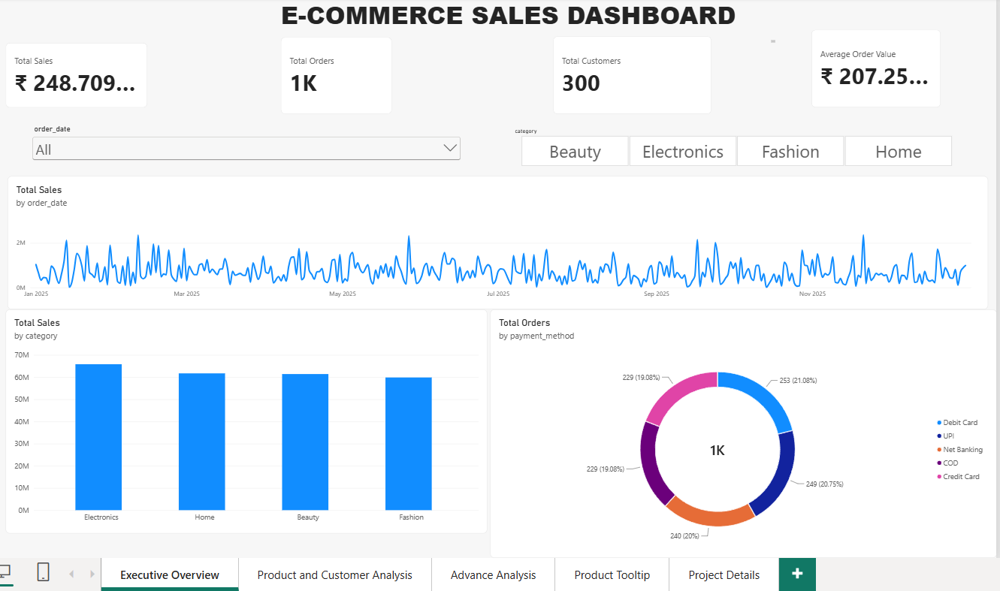
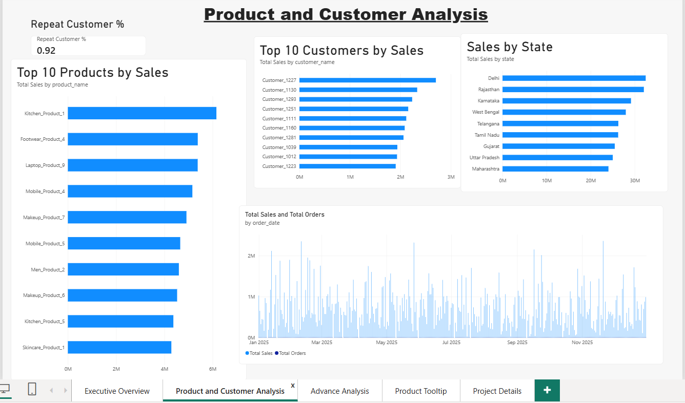
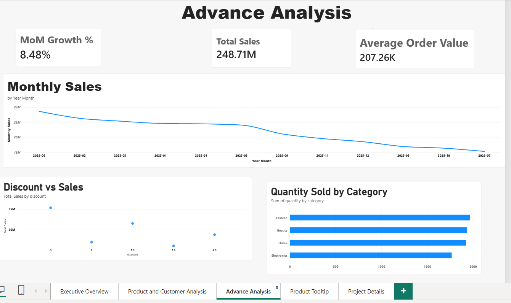
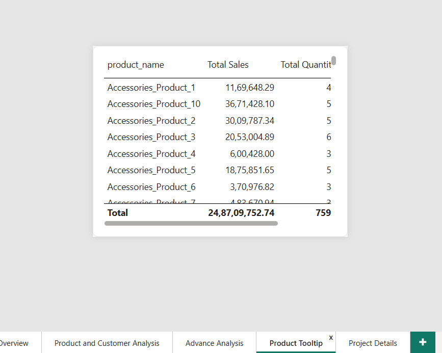

# E-commerce Sales Analysis

## Project Overview

This project is an interactive Power BI dashboard developed to analyze e-commerce sales performance, customers, products, orders, quantity, discounts, payment methods, and monthly sales trends.

The project focuses on transforming sales data into meaningful business insights using Power Query, DAX, data modeling, and interactive Power BI visualizations.

## Tools & Technologies

- Power BI Desktop
- Power Query
- DAX
- Data Modeling
- Data Cleaning
- Interactive Visualizations

## Key KPIs

The dashboard includes the following key performance indicators:

- Total Sales
- Total Orders
- Total Customers
- Average Order Value (AOV)
- Total Quantity
- Average Selling Price (ASP)
- Product Rank
- Repeat Customer %
- Monthly Sales
- Month-over-Month (MoM) Growth %

## Key Analysis

The dashboard provides analysis of:

- Monthly Sales Trends
- Category-wise Sales
- Product-level Sales
- Customer-level Sales
- State-wise Sales
- Payment Method Analysis
- Quantity Analysis
- Discount vs Sales Analysis
- Product Ranking
- Repeat Customer Analysis
- Month-over-Month Sales Growth

## DAX Analysis

### Total Sales

Calculates the total sales generated from all transactions.

```DAX
Total Sales = SUM(Sales[Sales])
```

### Total Orders

Counts the unique orders in the dataset.

```DAX
Total Orders = DISTINCTCOUNT(Sales[Order ID])
```

### Average Order Value

Calculates the average sales value per order.

```DAX
Average Order Value = DIVIDE([Total Sales], [Total Orders], 0)
```

### Average Selling Price

Calculates the average selling value per quantity sold.

```DAX
Average Selling Price = DIVIDE([Total Sales], [Total Quantity], 0)
```

### Product Rank

Ranks products based on their sales performance.

### Repeat Customer %

Measures the percentage of customers who made repeat purchases.

### MoM Growth %

Measures the change in sales compared with the previous month.

## Dashboard Features

- Interactive KPI Cards
- Interactive Slicers
- Monthly Sales Trend
- Category-wise Analysis
- Product-level Analysis
- Customer-level Analysis
- State-wise Analysis
- Payment Method Analysis
- Product Ranking
- Repeat Customer Analysis
- Discount vs Sales Analysis
- Category-wise Quantity Analysis
- Interactive Product Tooltip
- Page Navigation

## Report Pages

### 1. Executive Overview

Provides a high-level view of overall e-commerce performance through key KPIs, sales trends, category analysis, and other important business metrics.

### 2. Product and Customer Analysis

Provides detailed analysis of product and customer performance, including product sales, customer sales, ranking, and related metrics.

### 3. Advance Analysis

Contains deeper analysis such as discount vs sales, quantity analysis, repeat customers, monthly growth, and other business-focused insights.

### 4. Product Tooltip

An interactive tooltip page designed to provide additional product-level information when users interact with dashboard visuals.

### 5. Project Details

Contains project-related information and details about the analysis.

## Business Questions

This project helps answer questions such as:

1. What is the total sales performance of the business?
2. Which categories generate the highest sales?
3. Which products perform best based on sales?
4. Which customers contribute the most sales?
5. How do sales change month by month?
6. Which payment methods are most commonly used?
7. Which states generate higher sales?
8. How does discount relate to sales performance?
9. Which categories have higher quantities sold?
10. What percentage of customers are repeat customers?
11. Which products have the highest sales ranking?
12. How is monthly sales growth changing over time?

## Dashboard Preview

### Executive Overview



### Product and Customer Analysis



### Advance Analysis



### Product Tooltip



## Key Learning

This project provided practical experience in Power BI dashboard development, data cleaning, DAX calculations, interactive filtering, product and customer analysis, sales trend analysis, ranking, and business-focused data visualization.

## Repository Purpose

This project demonstrates practical Data Analyst skills in Power BI, DAX, data analysis, and dashboard development using an e-commerce sales dataset.
